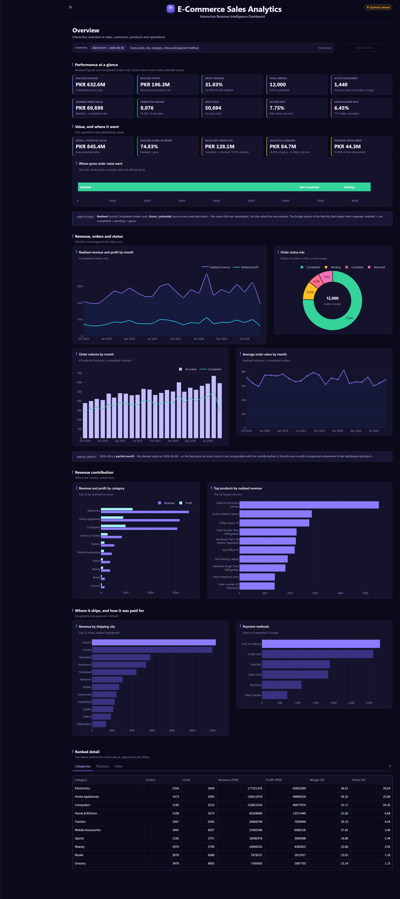

# E-Commerce Sales Analysis

A portfolio data analysis project built on a realistic, fictional e-commerce
dataset. The goal is to practise the full data analysis workflow: cleaning
data with Python/Pandas, loading it into MySQL, answering business questions
with SQL, and presenting the findings with Matplotlib.

The project covers a Pakistani online marketplace selling electronics, home
appliances, fashion, beauty, sports, books, grocery and home & kitchen
products, with all amounts in PKR.

## Dataset files

All files live in `data/` and are generated by `scripts/generate_dataset.py`
using a fixed random seed, so the data is identical on every run.

| File | Rows | Description |
| --- | --- | --- |
| `customers.csv` | 1,500 | Customer details, city and signup date |
| `products.csv` | 300 | Product catalogue, price, cost and stock |
| `orders.csv` | 12,000 | Order header with date, status and shipping city |
| `order_items.csv` | 30,006 | The products inside each order |
| `payments.csv` | 12,000 | One payment record per order |

The tables are related in the usual way:

```
customers.customer_id  ->  orders.customer_id
orders.order_id        ->  order_items.order_id
products.product_id    ->  order_items.product_id
orders.order_id        ->  payments.order_id
```

Revenue is **not** stored in any column. It is meant to be calculated later as:

```
quantity * unit_price * (1 - discount_percent / 100)
```

Product `cost` is stored in `products.csv` so profit can be calculated later
by joining `order_items` to `products`.

## Project structure

```
data/           the five generated CSV files
scripts/        dataset generation, validation, dashboard verification and tests
sql/            MySQL schema, import, validation and analysis queries
notebooks/      Jupyter notebooks (exploratory analysis)
dashboard/      the interactive Streamlit application (Phases 4 and 5)
visualizations/ Phase 2 Matplotlib charts, plus a screenshot of the dashboard
```

## Technologies

- **Python** and **Pandas** - cleaning and exploring the data
- **NumPy** - calculations
- **MySQL** - relational storage and SQL business analysis
- **Matplotlib** - charts and visualisations
- **Streamlit** and **Plotly** - the interactive dashboard

Python dependencies are listed in `requirements.txt`. The SQL layer and the
dashboard additionally require MySQL 8.0.

## How to reproduce the data

```bash
pip install -r requirements.txt
python scripts/generate_dataset.py
python scripts/validate_dataset.py
```

## SQL / MySQL Analysis

The same e-commerce dataset is also loaded into a MySQL database and analysed
with SQL. This part of the project lives entirely in `sql/`; the executed
results are recorded in [`sql/sql_results_summary.md`](sql/sql_results_summary.md)
and the folder is documented in [`sql/README.md`](sql/README.md).

The SQL work covers:

- **Relational database design** - five tables mirroring the source CSV files,
  with a documented key and constraint strategy.
- **Primary and foreign keys** - plus `UNIQUE`, `CHECK` and `ENUM` constraints
  that make invalid data impossible to store under `STRICT_TRANS_TABLES`.
- **Data validation** - 42 integrity checks covering row counts, key
  uniqueness, foreign-key integrity, nulls, date and numeric validity, allowed
  status values and the one-payment-per-order relationship.
- **Joins** - `INNER` and `LEFT` joins across the five tables, with explicit
  attention to join cardinality so a one-to-many relation never multiplies a
  monetary total.
- **Aggregation, `GROUP BY` and `HAVING`** - revenue, profit, margin, units and
  order counts by category, product, city, customer and time period.
- **Subqueries** - scalar, derived-table and correlated subqueries.
- **CTEs (`WITH`)** - used to name intermediate results and keep complex queries
  readable.
- **Window functions** - `ROW_NUMBER`, `RANK`, `DENSE_RANK`, `LAG` and
  `SUM() OVER` for ranking, running totals and month-over-month change.
- **Business analysis** - twenty portfolio business questions, plus a
  metric-by-metric reconciliation of the SQL results against the Phase 2 pandas
  results.

The schema, import and validation scripts (`sql/01`–`sql/05`) build the database
from the CSV files; `sql/06`–`sql/14` perform the analysis. The CSV files remain
the single source of truth and are never modified.

### Database architecture

Five tables, 31 columns, InnoDB, `utf8mb4_0900_ai_ci`. The shape mirrors the
CSVs one-to-one so that the SQL and the pandas phases can be compared without
either being translated.

| Table | Rows | Key columns | Constraints that matter |
| --- | --- | --- | --- |
| `customers` | 1,500 | `customer_id`, `name`, `email`, `gender`, `age`, `city`, `signup_date` | PK `customer_id`, `UNIQUE(email)`, age and email `CHECK` |
| `products` | 300 | `product_id`, `product_name`, `category`, `subcategory`, `brand`, `price`, `cost`, `stock_quantity` | PK `product_id`, `CHECK cost < price` |
| `orders` | 12,000 | `order_id`, `customer_id`, `order_date`, `status`, `shipping_city` | PK `order_id`, FK → `customers` `RESTRICT`, `ENUM` status |
| `order_items` | 30,006 | `order_item_id`, `order_id`, `product_id`, `quantity`, `unit_price`, `discount_percent` | PK, FK → `orders` `CASCADE`, FK → `products` `RESTRICT`, `UNIQUE(order_id, product_id)` |
| `payments` | 12,000 | `payment_id`, `order_id`, `payment_method`, `payment_status`, `payment_date` | PK, FK → `orders` `CASCADE`, `UNIQUE(order_id)`, `ENUM` method and status |

Three decisions carry most of the analytical weight:

- **Money is `DECIMAL(10,2)`, never `FLOAT`.** Binary floating point cannot
  represent 0.1 exactly, which makes money totals drift. `DECIMAL` is exact and
  holds up to 99,999,999.99, well above the largest value in the data.
- **No table stores a revenue or total column.** Revenue is always computed as
  `quantity * unit_price * (1 - discount_percent / 100)`, so a derived figure
  cannot go stale relative to the lines it came from. `payments` likewise has no
  amount: payment value is derived from the order lines.
- **Delete behaviour is not uniform.** `orders → customers` is `RESTRICT`, so a
  customer with sales history cannot be silently deleted; `order_items` and
  `payments` `CASCADE` from `orders`, because they have no meaning alone; and
  `order_items → products` is `RESTRICT`, because deleting a sold product would
  rewrite history. `UNIQUE(order_id)` on `payments` and
  `UNIQUE(order_id, product_id)` on `order_items` make the two join paths that
  would otherwise duplicate money structurally impossible.

## Interactive Dashboard

The same MySQL database is presented as a seven-page interactive dashboard built
with **Streamlit** and **Plotly**. Every figure, KPI and table is computed live
from `ecommerce_sales_analysis`; nothing is hardcoded, pre-rendered or copied
out of the Phase 2 notebook. The dashboard never writes to the database, and the
Phases 1–3 artefacts are untouched.



### Architecture

The code is a package rather than one large script. `dashboard/app.py` puts the
project root on `sys.path` so the relative imports below resolve, then the
modules split cleanly by responsibility:

```
dashboard/
  app.py          entry point: page config, sidebar, global filters, page routing
  config.py       .env loading, database config, palette, metric definitions
  database.py     connection handling, safe IN-list building, error translation
  queries.py      every SQL statement, parameterised, plus the shared filter builder
  metrics.py      pure derivations from raw aggregates (rates, margins, segments)
  charts.py       Plotly figure builders
  components.py   reusable UI: KPI cards, sections, tables, error panels
  utils.py        the Filters dataclass, formatters, DataFrame helpers
  phase3_reference.py   Phase 3 values, used *only* as test fixtures
  views/          one module per page
```

`phase3_reference.py` is never imported by a page. It exists so
`scripts/verify_dashboard_metrics.py` can compare the live dashboard against the
Phase 3 SQL results, which is the check that the two independent
implementations agree.

### Design system

Every visual decision lives in one place rather than being repeated per page.
`dashboard/config.py` holds the design tokens — palette, surface colours, a
spacing and radius scale, the font stack, chart heights — and they are consumed
twice: `dashboard/charts.py` reads the same values to build the Plotly figures,
and `dashboard/components.py` publishes them to CSS as `--d-*` custom
properties. A colour therefore cannot drift between a chart and the card around
it, because there is only one value to change.

`components.py` injects a single stylesheet and then renders a small set of
reusable primitives that the pages compose:

| Component | What it produces |
| --- | --- |
| `page_header` / `section` | Page title and subtitle, and the headings inside a page |
| `topbar` | The centred project title, its sub-heading, and the dataset badge |
| `kpi_grid` / `Kpi` | The metric tiles, laid out as one CSS grid |
| `panel` | A titled card, a context manager over a bordered container |
| `chart` | A Plotly figure with the shared toolbar and no theme override |
| `data_table` | A DataFrame with consistent formatting and units in the headers |
| `callout` / `definition_note` / `bullets` | The quiet explanatory strips |
| `error_panel` / `empty_state` | The two failure presentations |
| `connection_badge` | The sidebar connection status |
| `filter_bar` | Active-filter chips, the current scope, and a Reset button |

#### Header

The header is the project's title, not a slim application bar. The name sits on
the true horizontal centre of the main column at 33.6 px / 700, with the
sub-heading directly beneath it at 14 px / 500, and a hairline rule closing the
band. Two decisions are load-bearing:

- **The brand mark is out of flow.** It is absolutely positioned in the space to
  the left of the title rather than sitting beside it in a flex row. A flex row is
  centred as a *unit*, which pushes the title text right by half of
  (mark + gap) — 22 px at this size, and enough to be visibly off-centre.
  Measured centre offset is 0 px at every breakpoint.
- **The dataset badge is out of flow too.** As a flex sibling it would occupy
  space in the header row and offset the centred title by half its own width; the
  two blocks are unequal, so only removing one from the flow centres the other
  honestly. Below 1000 px the corner no longer has room beside a centred title, so
  the badge drops beneath it and stays centred rather than being allowed to
  collide.

The band is 78 px tall at desktop widths and 93 px at the narrowest, and the
title steps down 33.6 → 28.5 → 21.6 px across two breakpoints. The project title
is the document's only `h1`; page titles are `h2`, so a screen reader can tell
the site name from the current section.

#### Pie and donut labels

Every pie and donut prints each slice's share on the arc, because a mix chart
exists to make a split legible at a glance and a legend of bare names leaves the
reader comparing wedge angles by eye — the one thing a wedge is worst at. Two
details make that work:

- **The share is computed in Python, not by Plotly.** `%{percent}` runs through
  d3-format under the *viewer's* locale, which on this stack renders 75.6 as
  `75,6` — a comma where every other number in the dashboard uses a decimal
  point, including the money figures two cards away. `_shares()` formats the
  string instead, and the same string is passed as `customdata` so the on-arc
  label and the hover tooltip cannot disagree. Both remain available in the
  hover, as before.
- **Label ink is chosen per slice.** A pie is the only chart whose label rests
  *on* a data mark rather than beside it, and the palette spans both ends: white
  on the amber and emerald arcs is about 1.9:1, near-black on the deep violet arcs
  about 1.2:1. `_ink_on()` resolves each label against its own fill; the worst
  measured contrast across every pie-reachable fill is 5.99:1, above the 4.5:1
  AA floor for normal text.

`uniformtext` is set to `mode="show"` because a four-way mix leaves narrow slices
and Plotly's default is to drop text that does not fit — which is exactly the
share a reader most wants. Type shrinks to a 9 px floor instead. No percentage
labels were added to any bar or line chart.

The layout is responsive rather than fixed. The KPI band publishes its own
column count as `--d-kpi-cols` and media queries step it down as the content
width shrinks, so a band of metric cards fills whole rows at every breakpoint
without a second column count to maintain. Ranked bar charts wrap long product
names onto at most two lines and keep the full name in the hover tooltip, so a
half-width card stays readable. Verified clean (no horizontal overflow, no clipped
labels, no light surfaces) at 1600, 1366, 1100 and 820 px across all seven pages.

`.streamlit/config.toml` pins a dark appearance, mirroring the tokens in
`config.py` by hand. Streamlit 1.64 does not expose its theme as CSS custom
properties, so a light/dark switcher cannot be driven from the design tokens;
rather than ship a half-working toggle, the appearance is pinned and the
limitation is recorded here.

Three details make the dark theme hold together rather than just look dark:

- **Chart papers are fully transparent.** Every Plotly figure leaves
  `paper_bgcolor` and `plot_bgcolor` at `rgba(0,0,0,0)`, so a plot inherits the
  card's fill from CSS instead of painting its own rectangle inside it. A light
  rectangle inside a dark card is the single most obvious way a dashboard like
  this can fail.
- **"Quiet" means a different colour per surface.** The bar charts highlight the
  leader and mute the rest. On a light card a muted bar is a *lighter* tint of the
  accent and still recedes; on a near-black canvas that same tint is the
  brightest thing in the frame, which inverts the hierarchy. `PALETTE` therefore
  carries both `revenue_soft` (accent-tinted text, for chips and labels) and
  `revenue_dim` (a bar fill 5.8× dimmer than the accent, for muted bars).
- **The whole palette is checked for contrast against the card, not against
  white.** Every hue is picked to hold its contrast against `#15132B`, so no
  series has to be brightened to stay legible — which is what would otherwise
  turn a dark theme into a neon one.

### Pages

| Page | What it answers |
| --- | --- |
| Overview | Realised revenue, profit, margin, orders, customers, AOV, units, return and cancellation rate, with the headline trends and top performers |
| Sales Analysis | Revenue over time, year-over-year comparison, category and city contribution, basket size, discount effect |
| Products | Top products by revenue / units / order frequency, profitability per product, category performance, discount-band analysis, sortable product table |
| Customers | Registered vs active customers, repeat rate, top spenders, orders-per-customer distribution, spend segmentation, searchable customer table |
| Operations / Orders | Status mix, monthly order volume, orders by city, average order size and units per order, searchable order-level table |
| Payments | Method usage and share, revenue per method, payment status split, failure rate by method, method × status heatmap |
| Insights | The findings established in Phases 2 and 3, each labelled as a property of the synthetic dataset |

### Filters

Six global filters in the sidebar apply to every page at the same time, so the
whole dashboard describes one consistent slice of the data:

- **Date range** - both bounds, defaults to the full data window
- **City** - multi-select
- **Category** - multi-select
- **Subcategory** - multi-select, narrowed to the selected categories
- **Order status** - multi-select, defaults to all four statuses
- **Payment method** - multi-select

Active filters are shown as chips in a filter bar above the page, alongside the
current data scope and a live count of how many filters are narrowing the view.
A **Reset all filters** button sits next to that bar and in the sidebar; both
are disabled when nothing is filtered.

Two semantics are worth knowing:

- **Category and subcategory filter at line level.** Selecting a category counts
  the value of the matching order lines, not the whole value of any order that
  happens to contain one. Order counts are always
  `COUNT(DISTINCT order_id)`.
- **The default status filter is all four statuses, not Completed.** The rates on
  the Overview page (return rate, cancellation rate) are then true out of the
  box. *Realised* revenue and profit always mean **Completed orders only**,
  matching the Phase 3 definitions, and any figure that includes the other
  statuses is labelled gross or potential.

### Install and run

```bash
pip install -r requirements.txt
```

Configure the database credentials once by copying the template and filling it
in. No password is stored in the source code:

```bash
copy .env.example .env      # Windows
cp .env.example .env        # macOS / Linux
```

`.env` is listed in `.gitignore` and is never committed. The variables are:

| Variable | Meaning | Default |
| --- | --- | --- |
| `DB_HOST` | MySQL host | `localhost` |
| `DB_PORT` | MySQL port | `3306` |
| `DB_USER` | MySQL user | — (required) |
| `DB_PASSWORD` | MySQL password | — (required) |
| `DB_NAME` | Database name | `ecommerce_sales_analysis` |

Start the dashboard:

```bash
streamlit run dashboard/app.py
```

If `streamlit` is not on your `PATH` (common on Windows, where pip's `Scripts`
folder is not added automatically), run it as a module instead - this is
exactly equivalent and is the form verified during development:

```bash
python -m streamlit run dashboard/app.py
```

The app then serves on <http://localhost:8501>. If MySQL is stopped or the
credentials are wrong, the app says so in plain language in the sidebar and
shows a single error panel - it never shows a stack trace, and the password is
never echoed back.

### Verification

The dashboard is checked against the Phase 3 SQL results rather than being
trusted:

```bash
python scripts/verify_dashboard_metrics.py     # 29 headline metrics + 10 category revenues vs Phase 3
python scripts/test_dashboard_filters.py       # 7 filter scenarios + join-duplication checks
python scripts/test_dashboard_pages.py         # renders all 7 pages and drives the filters
python scripts/test_dashboard_failure_modes.py # MySQL down, bad password, missing config
python scripts/test_sql_helpers.py             # IN-list and percent-escaping unit tests
```

`test_dashboard_filters.py` also proves no join duplicates money: the payment,
city, category, trend, product and customer queries each sum to exactly the
KPI total, and `order_table` returns exactly one row per order. The payment
queries aggregate `order_items` to one row per order in a CTE *before* joining
`payments`, so they stay correct even if `payments` stopped being one-to-one.

`test_dashboard_pages.py` also guards the presentation layer, because two
rendering faults in it were silent — the page drew, just wrongly. One check
asserts that no `st.markdown` payload contains an indented line, which CommonMark
would turn into a visible code block and which is what once made the dashboard
display its own HTML. The other asserts the injected stylesheet is a single
line, has balanced braces, has no empty selector, and applies every selector
suffix to every selector in the group.

## Current phase

Five phases are complete.

- **Phase 1 - Dataset creation and validation (complete).** The dataset has been
  generated and passes all 78 validation checks, covering missing values,
  duplicate primary keys, invalid foreign keys, invalid dates, negative values,
  impossible discounts, invalid categories, status and payment values, and
  orphan records.
- **Phase 2 - Exploratory data analysis (complete).** The dataset was explored
  with pandas and NumPy in `notebooks/01_initial_exploration.ipynb`, with
  Matplotlib charts saved to `visualizations/`.
- **Phase 3 - SQL / MySQL analysis (complete).** The dataset was loaded into the
  `ecommerce_sales_analysis` database, validated with SQL, and analysed with a
  set of SQL scripts covering relational design, joins, aggregation, subqueries,
  CTEs, window functions and twenty business questions. The major results agree
  with Phase 2 wherever the underlying definitions are identical.
- **Phase 4 - Interactive dashboard (complete).** A seven-page Streamlit
  application over the same MySQL database, with six global filters, live KPIs,
  interactive Plotly charts and searchable tables. Its metrics reconcile with
  Phase 3, and the verification scripts listed above all pass.
- **Phase 5 - Dashboard redesign (complete).** The Phase 4 application was
  rebuilt around a shared design system rather than around individual widgets:
  centralised design tokens consumed by both the CSS and the charts, a
  reusable component set, a responsive layout verified from 1680px down to
  820px, and a restructured Insights page that reads as a report. The database,
  the SQL, the filters and every analytical result are unchanged — the
  verification scripts pass with the same numbers as before the redesign.
- **Phase 5.1 - Dark theme (complete).** The same design system, restyled for a
  near-black violet/indigo surface: dark tokens in `config.py` mirrored into
  `.streamlit/config.toml`, a Plotly theme matched to it, KPI cards and charts
  restated on the dark card, and the Overview reorganised into a dashboard grid
  (a single ten-card KPI block, then chart rows) instead of a vertical stack.
  Presentation only — no query, metric, filter or page changed, and the
  verification scripts pass with identical numbers.
- **Phase 5.2 - Header and pie labels (complete).** Two focused presentation
  changes. The header became a centred portfolio title at 33.6 px / 700 with a
  secondary 14 px sub-heading, measured at 0 px centre offset across seven
  breakpoints, with the dataset badge held in the top-right corner and the
  project title promoted to the document's only `h1`. Every pie and donut now
  prints each slice's share on the arc, with the percentage formatted in Python
  so it matches the dashboard's decimal convention and a per-slice label colour
  so it stays legible on both the amber and the deep violet fills. The value and
  the share both remain in the hover. No bar or line chart gained a percentage
  label, and no query, metric, filter, page or calculation changed — the same 203
  verification checks pass with identical numbers.

## Limitations

Honest about what the project does not do:

- **The data is synthetic.** It is generated with a fixed seed by
  `scripts/generate_dataset.py` and is realistic in shape, not in origin. Every
  finding in the dashboard is a property of that generated data, and the Insights
  page labels them as such.
- **The last month is partial.** The data ends on 2026-09-26, so 2026-09 is an
  incomplete month. Month-over-month and year-over-year comparisons exclude it
  rather than showing a drop that is really a truncation. The Overview says so
  in a note.
- **Order status and payment status are different things.** An order can be
  `Completed` while its payment is `Refunded` — 635 such orders exist in this
  dataset. The dashboard keeps the two populations separate and never nets them
  against each other.
- **The dashboard is single-user and read-only.** There is no authentication, no
  write path, and no query sharing: navigation is a radio widget, so a given page
  cannot be linked to directly. Queries are cached per process, so two visitors
  to the same process share the cached result within the cache TTL.
- **Dark appearance only.** Streamlit 1.64 does not expose its theme as CSS
  custom properties, so the design tokens cannot be re-pointed at a light
  palette automatically. The appearance is pinned in `.streamlit/config.toml`
  rather than shipping a switcher that would not work.
- **`products` has no rating and `payments` has no amount**, because the source
  CSVs have neither. Product quality and payment value are therefore derived or
  unavailable, never guessed.
